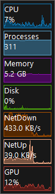

<!--  RadMeter -->
#  RadMeter

Performance meter widget.

Display meters in a widget using microsoft windows builtin [performance counters api](https://docs.microsoft.com/en-us/windows/win32/perfctrs/performance-counters-portal).

## Dependencies
)
